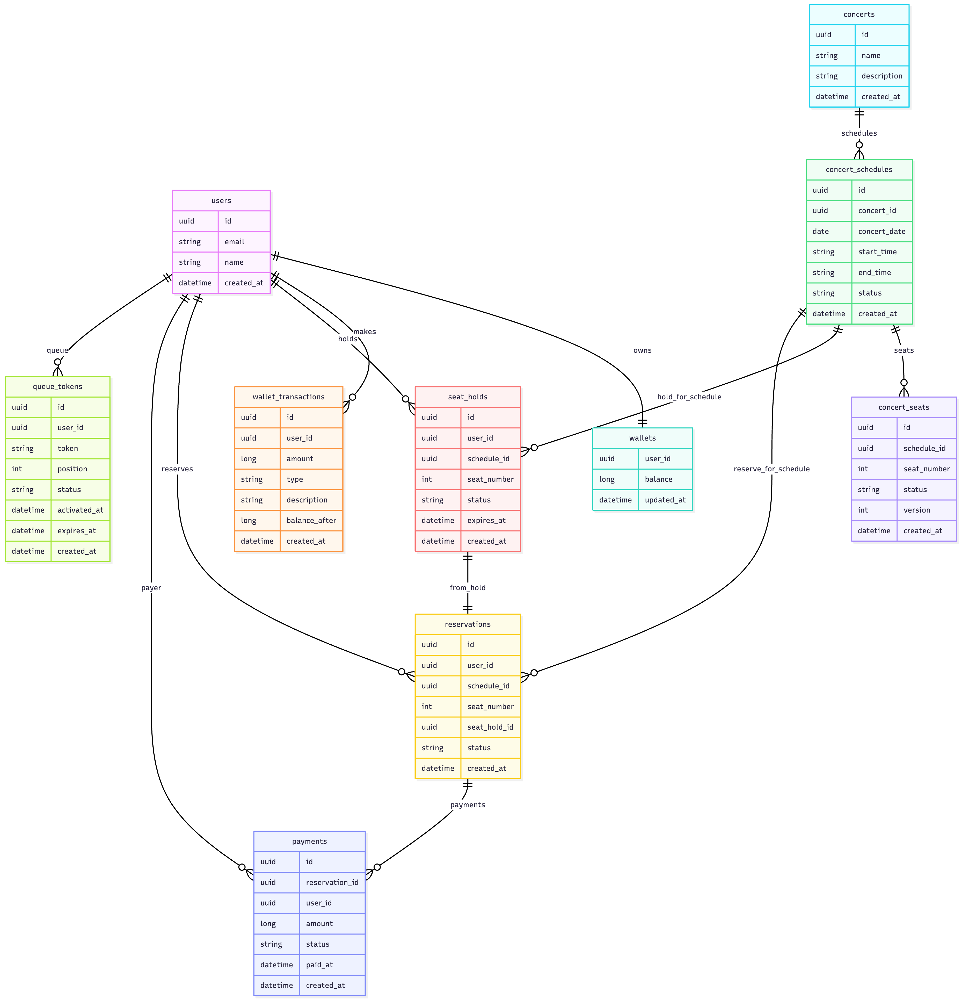

# 콘서트 예약 서비스 ERD

콘서트 좌석 예약, 대기열, 포인트 결제 흐름을 모두 포함한 ERD 설계 문서입니다.  
아래 ERD 이미지는 `users`, `wallets`, `concerts`, `reservations`, `payments`, `queue_tokens` 등 핵심 도메인을 한 번에 보여줍니다.

---

## 1. 도메인 개요

서비스에서 사용되는 주요 도메인은 다음과 같이 나눌 수 있습니다.

1. **User & Wallet 도메인**
    - `users`, `wallets`, `wallet_transactions`
2. **Concert 도메인**
    - `concerts`, `concert_schedules`, `concert_seats`
3. **Reservation & SeatHold 도메인**
    - `seat_holds`, `reservations`
4. **Payment 도메인**
    - `payments` (+ `wallet_transactions`와 긴밀히 연관)
5. **Queue(대기열) 도메인**
    - `queue_tokens`

각 도메인별로 역할과 테이블 구조를 간단히 설명합니다.

---

## 2. User & Wallet 도메인

### 2.1 users

- **역할**: 서비스의 회원(고객)을 표현하는 기본 엔티티
- **주요 컬럼**
  | 컬럼        | 타입    | 설명                  |
  | ---------- | ------- | --------------------- |
  | `id`       | `uuid`  | 유저 식별자 (PK)      |
  | `email`    | `string`| 로그인/식별용 이메일 |
  | `name`     | `string`| 유저 이름             |
  | `created_at` | `datetime` | 가입 시각        |
- **관계**
    - `users` 1 : 1 `wallets`
    - `users` 1 : N `wallet_transactions`
    - `users` 1 : N `reservations`
    - `users` 1 : N `payments`
    - `users` 1 : N `seat_holds`
    - `users` 1 : N `queue_tokens`

### 2.2 wallets

- **역할**: 유저의 포인트 잔액을 관리하는 지갑
- **주요 컬럼**
  | 컬럼        | 타입     | 설명                   |
  | ---------- | -------- | ---------------------- |
  | `user_id`  | `uuid`   | 유저 ID (PK, FK)      |
  | `balance`  | `long`   | 현재 포인트 잔액      |
  | `updated_at` | `datetime` | 마지막 변경 시각 |
- **도메인 규칙**
    - 유저당 지갑은 **1개**만 존재 (1:1 관계)
    - 잔액은 음수가 되지 않도록 비즈니스 로직에서 제약

### 2.3 wallet_transactions

- **역할**: 포인트 충전/사용 내역(거래 이력)을 기록
- **주요 컬럼**
  | 컬럼           | 타입      | 설명                                 |
  | ------------- | --------- | ------------------------------------ |
  | `id`          | `uuid`    | 거래 식별자 (PK)                     |
  | `user_id`     | `uuid`    | 거래 대상 유저                       |
  | `amount`      | `long`    | 거래 금액 (충전: +, 사용: -)        |
  | `type`        | `string`  | `CHARGE`, `PAYMENT` 등 거래 타입    |
  | `description` | `string`  | 비고/메모                            |
  | `balance_after` | `long`  | 거래 이후 잔액(스냅샷)              |
  | `created_at`  | `datetime`| 거래 시각                            |
- **도메인 규칙**
    - 모든 포인트 변화는 반드시 `wallet_transactions`에 기록
    - `wallets.balance`는 이 테이블의 결과와 일관성을 유지해야 함

---

## 3. Concert 도메인

### 3.1 concerts

- **역할**: 공연(콘서트) 자체 정보
- **주요 컬럼**
  | 컬럼        | 타입      | 설명           |
  | ---------- | --------- | -------------- |
  | `id`       | `uuid`    | 공연 ID (PK)  |
  | `name`     | `string`  | 공연 이름      |
  | `description` | `string` | 공연 설명    |
  | `created_at` | `datetime` | 생성 시각   |

### 3.2 concert_schedules

- **역할**: 특정 공연의 날짜/회차 정보
- **주요 컬럼**
  | 컬럼          | 타입      | 설명                       |
  | ------------ | --------- | -------------------------- |
  | `id`         | `uuid`    | 스케줄 ID (PK)             |
  | `concert_id` | `uuid`    | 공연 ID (FK → concerts)   |
  | `concert_date` | `date`  | 공연 날짜                  |
  | `start_time` | `string`  | 시작 시간                  |
  | `end_time`   | `string`  | 종료 시간                  |
  | `status`     | `string`  | `OPEN`, `CLOSED` 등 상태   |
  | `created_at` | `datetime`| 생성 시각                  |
- **관계**
    - `concerts` 1 : N `concert_schedules`

### 3.3 concert_seats

- **역할**: 특정 스케줄에 대한 좌석(1~50번) 상태 관리
- **주요 컬럼**
  | 컬럼         | 타입      | 설명                                |
  | ----------- | --------- | ----------------------------------- |
  | `id`        | `uuid`    | 좌석 엔티티 ID (PK)                |
  | `schedule_id` | `uuid`  | 스케줄 ID (FK → concert_schedules) |
  | `seat_number` | `int`   | 좌석 번호 (1~50)                    |
  | `status`    | `string`  | `AVAILABLE`, `HELD`, `SOLD` 등     |
  | `version`   | `int`     | 낙관적 락 버전                      |
  | `created_at` | `datetime` | 생성 시각                          |
- **도메인 규칙**
    - (schedule_id, seat_number)는 유니크
    - `status`는 예약/결제 흐름에 따라 상태 전이:
        - `AVAILABLE` → (임시 배정) → `HELD` → (결제 완료) → `SOLD`

---

## 4. Reservation & SeatHold 도메인

### 4.1 seat_holds

- **역할**: 좌석 임시 배정(홀드) 정보.  
  결제 전 일정 시간 동안 다른 유저가 좌석을 못 잡도록 하는 역할.
- **주요 컬럼**
  | 컬럼          | 타입      | 설명                              |
  | ------------ | --------- | --------------------------------- |
  | `id`         | `uuid`    | 홀드 ID (PK)                      |
  | `user_id`    | `uuid`    | 홀드한 유저                       |
  | `schedule_id` | `uuid`   | 스케줄 ID                         |
  | `seat_number` | `int`    | 좌석 번호                         |
  | `status`     | `string`  | `PENDING`, `CONFIRMED`, `EXPIRED` |
  | `expires_at` | `datetime`| 홀드 만료 시각                    |
  | `created_at` | `datetime`| 생성 시각                         |
- **관계**
    - `users` 1 : N `seat_holds`
    - `concert_schedules` 1 : N `seat_holds`

### 4.2 reservations

- **역할**: 유저가 좌석에 대해 실제 예약(결제 전/후 포함)을 나타내는 엔티티.
- **주요 컬럼**
  | 컬럼          | 타입      | 설명                                   |
  | ------------ | --------- | -------------------------------------- |
  | `id`         | `uuid`    | 예약 ID (PK)                           |
  | `user_id`    | `uuid`    | 예약 유저                              |
  | `schedule_id` | `uuid`   | 스케줄 ID                              |
  | `seat_number` | `int`    | 예약 좌석 번호                         |
  | `seat_hold_id` | `uuid`  | 관련 seat_hold ID (FK)                |
  | `status`     | `string`  | `HELD`, `PAID`, `CANCELLED` 등 예약 상태 |
  | `created_at` | `datetime`| 생성 시각                             |
- **관계**
    - `seat_holds` 1 : 1 `reservations` (from_hold)
    - `users` 1 : N `reservations`
    - `concert_schedules` 1 : N `reservations`
    - `reservations` 1 : N `payments`
- **도메인 규칙**
    - `HELD` 상태에서만 결제 가능
    - 홀드 만료 시 혹은 취소 시 `status = CANCELLED` 처리

---

## 5. Payment 도메인

### 5.1 payments

- **역할**: 특정 예약에 대한 결제 정보를 기록하는 엔티티.
- **주요 컬럼**
  | 컬럼            | 타입      | 설명                                 |
  | -------------- | --------- | ------------------------------------ |
  | `id`           | `uuid`    | 결제 ID (PK)                         |
  | `reservation_id` | `uuid`  | 대상 예약 ID                         |
  | `user_id`      | `uuid`    | 결제한 유저                         |
  | `amount`       | `long`    | 결제 금액                           |
  | `status`       | `string`  | `SUCCESS`, `FAILED` 등 결제 상태    |
  | `paid_at`      | `datetime`| 결제 완료 시각                       |
  | `created_at`   | `datetime`| 레코드 생성 시각                     |
- **관계**
    - `reservations` 1 : N `payments`
    - `users` 1 : N `payments`
- **관련 도메인 동작**
    - 결제 성공 시:
        - `wallets.balance` 차감
        - `wallet_transactions`에 `PAYMENT` 타입 거래 생성
        - `reservations.status` → `PAID`
        - `concert_seats.status` → `SOLD`
        - 관련 `queue_tokens` 만료 처리

---

## 6. Queue(대기열) 도메인

### 6.1 queue_tokens

- **역할**: 대기열에 들어온 유저를 식별하는 토큰 및 상태 관리.
- **주요 컬럼**
  | 컬럼          | 타입      | 설명                                      |
  | ------------ | --------- | ----------------------------------------- |
  | `id`         | `uuid`    | 내부 식별자 (PK)                          |
  | `user_id`    | `uuid`    | 유저 ID                                  |
  | `token`      | `string`  | 외부에 노출되는 대기열 토큰 (unique)     |
  | `position`   | `int`     | 대기열 상의 현재 순번                    |
  | `status`     | `string`  | `PENDING`, `ACTIVE`, `EXPIRED`           |
  | `activated_at` | `datetime` | ACTIVE로 전환된 시각                   |
  | `expires_at` | `datetime`| 토큰 만료 시각                            |
  | `created_at` | `datetime`| 생성 시각                                 |
- **관계**
    - `users` 1 : N `queue_tokens`
- **도메인 규칙**
    - 주요 API 호출 시 `X-QUEUE-TOKEN` 헤더를 통해 ACTIVE 상태인지 검증
    - 결제 완료 시 또는 일정 시간 경과 시 `EXPIRED`로 전환

---

## 7. 주요 흐름에서의 테이블 연계 요약

1. **대기열 입장**
    - `queue_tokens`에 PENDING 토큰 생성
    - Redis 등으로 대기 순서 관리 (애플리케이션 레벨)

2. **좌석 임시 배정(Seat Hold)**
    - `seat_holds`에 PENDING 레코드 생성 (`expires_at` = now + 5분)
    - `concert_seats.status`를 `HELD`로 변경
    - `reservations`에 `HELD` 상태 예약 생성

3. **결제**
    - `wallets.balance` 차감
    - `wallet_transactions`에 `PAYMENT` 내역 추가
    - `payments`에 결제 레코드 생성 (SUCCESS)
    - `reservations.status` → `PAID`
    - `concert_seats.status` → `SOLD`
    - 관련 `queue_tokens.status` → `EXPIRED`

이 문서는 ERD 이미지를 보면서 **각 도메인의 역할과 엔티티 간 관계**를 빠르게 이해하기 위한 용도로 사용합니다.  
