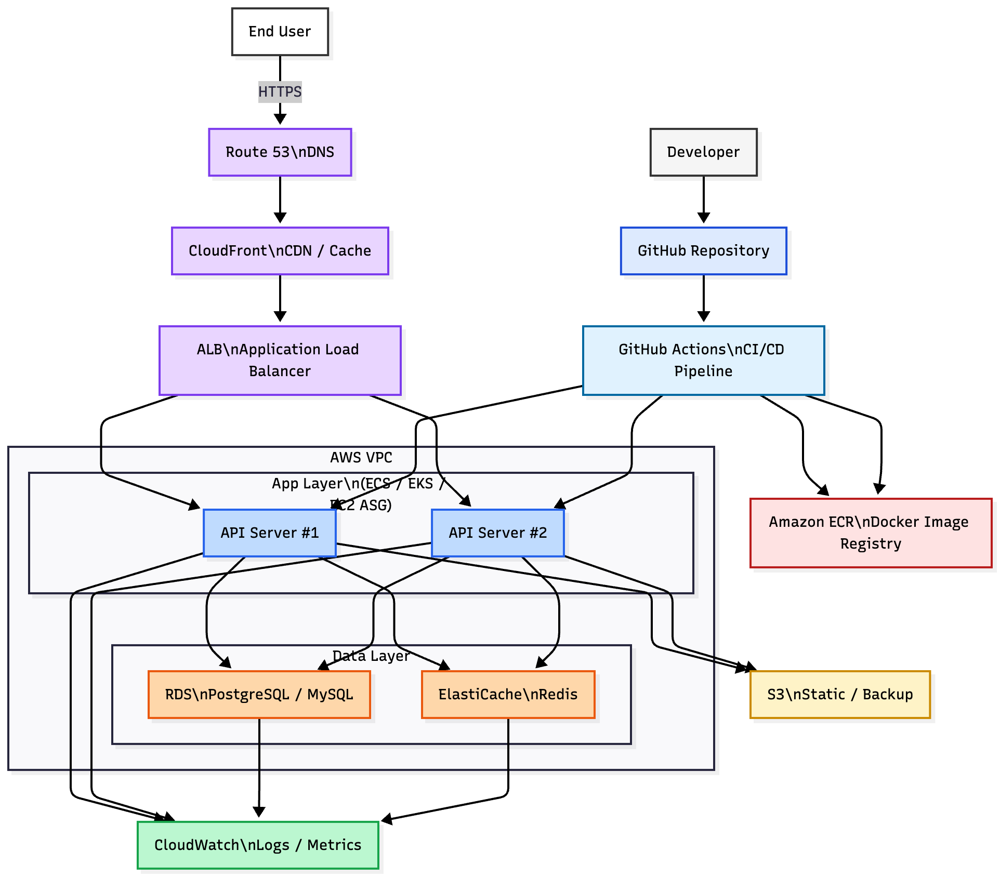

# 콘서트 예약 서비스 인프라 구조 (`infra.md`)

콘서트 예약 서비스의 **배포 파이프라인(CI/CD)** 과 **운영 인프라(AWS 기반)** 전체 구성을 정리한 문서입니다.  
대기열 기반 예약, 좌석 임시 배정(동시성 제어), 포인트/결제 처리, 멀티 인스턴스 환경을 지원하는 것을 목표로 합니다.



---

## 1. 인프라 개요

전체 구조는 크게 **5가지 레이어**로 나눌 수 있습니다.

1. **End User Layer** (클라이언트)
2. **Edge Layer** (Route 53 / CloudFront / ALB)
3. **Application Layer** (API Server Cluster)
4. **Data Layer** (RDS / ElastiCache / S3)
5. **CI/CD & Observability Layer** (GitHub Actions, ECR, CloudWatch)

각 레이어가 담당하는 역할을 아래에서 설명합니다.

---

## 2. End User Layer

### End User

- 웹/모바일 사용자가 **HTTPS** 로 서비스에 접근
- 주요 기능
  - 콘서트 일정 / 좌석 조회
  - 대기열 입장 및 상태 조회
  - 좌석 선택 및 임시 배정
  - 포인트 충전 및 결제

**포인트**

- 모든 요청은 HTTPS 기반
- 프론트엔드(SPA 등)는 CloudFront + S3 정적 호스팅으로 서빙 가능

---

## 3. Edge Layer (Route 53 / CloudFront / ALB)

### 3.1 Route 53 (DNS)

- `api.example.com` 과 같은 도메인을 ALB에 매핑
- 헬스 체크, 다중 리전 구성 등 확장 가능

### 3.2 CloudFront (CDN / Cache)

- 정적 리소스(SPA 번들, 이미지 등) 캐싱
- 전 세계 엣지 로케이션을 통해 레이턴시 감소

### 3.3 ALB (Application Load Balancer)

- HTTP/HTTPS 요청을 다수의 API 서버로 분산
- 헬스 체크로 장애 인스턴스를 자동 제외
- Path/Host 기반 라우팅 정책 구성 가능

---

## 4. Application Layer (API Server Cluster)

### API Server #1 / #2

- Spring Boot 기반 REST API 서버
- ECS Task / EKS Pod / EC2 인스턴스로 실행 가능
- 무상태(Stateless) 설계를 지향 → Auto Scaling 및 롤링 배포에 유리

**주요 책임**

- 대기열 토큰 검증 (`X-QUEUE-TOKEN`)
- 콘서트 / 스케줄 / 좌석 조회
- 좌석 임시 배정(SeatHold) 및 상태 변경
- 포인트 충전 / 잔액 조회
- 결제 처리 (Reservation → Payment → Wallet)
- Redis 기반 대기열(ZSET), 토큰, 분산 락 사용

**동시성 & 멀티 인스턴스 고려**

- 여러 인스턴스가 동시에 좌석/결제를 처리해도:
  - Redis 기반 분산 락
  - DB 낙관적 락(버전 컬럼)
  를 활용해 **중복 예약/결제**를 방지

---

## 5. Data Layer

### 5.1 RDS (PostgreSQL / MySQL)

- 핵심 도메인 데이터 저장소
  - `users`, `wallets`, `wallet_transactions`
  - `concerts`, `concert_schedules`, `concert_seats`
  - `seat_holds`, `reservations`, `payments`
  - `queue_tokens`
- 트랜잭션 단위로 예약/결제/포인트 변경 처리

**특징**

- 좌석(`concert_seats`)에 `version` 컬럼을 두어 **낙관적 락** 적용
- 예약/결제는 단일 트랜잭션으로 처리하여 **일관성** 유지

---

### 5.2 ElastiCache (Redis)

- 대기열 및 동시성 제어를 위한 인메모리 저장소

**주요 사용처**

1. **대기열 관리**
   - Redis `ZSET` 으로 대기 순서를 정렬
   - 예: `queue:concert:{concertId}`

2. **분산 락**
   - 좌석 단위 락
   - 예: `SETNX seat:lock:{scheduleId}:{seatNumber} EX 5`

3. **토큰/세션 캐싱**
   - 대기열 토큰 상태/TTL 캐싱
   - ACTIVE 유저 수 제한, 속도 향상에 활용

---

### 5.3 S3 (Static / Backup)

- 정적 파일, 백업, 로그 파일 등 저장

예시 사용처

- 정적 프론트엔드 빌드 결과(SPA 배포)
- 데이터 백업 스냅샷
- 분석용 리포트 파일 등

---

## 6. CI/CD & Observability Layer

### 6.1 GitHub Repository

- 소스코드 버전 관리
- 브랜치 전략 예: `main` / `develop` / `feature/*`
- PR 기반 코드 리뷰 진행

### 6.2 GitHub Actions (CI/CD Pipeline)

**주요 단계**

1. **CI (Build & Test)**
   - Gradle/Maven 빌드
   - 단위/통합 테스트 실행
2. **Docker Image Build**
   - Spring Boot 애플리케이션을 Docker 이미지로 빌드
3. **Push to ECR**
   - AWS 자격 증명 기반으로 ECR에 이미지 push
4. **Deploy**
   - ECS: 서비스/Task Definition 업데이트 후 롤링 배포  
   - 또는 EKS: `kubectl apply` 로 Deployment 롤링 업데이트  
   - 또는 EC2: CodeDeploy/스크립트 기반 배포

### 6.3 Amazon ECR (Docker Image Registry)

- 빌드된 Docker 이미지를 저장
- ECS/EKS가 이미지를 pull하여 서비스 실행

---

### 6.4 CloudWatch (Logs / Metrics)

- **Logs**
  - API Server 로그, ECS/EKS 컨테이너 로그, 배치/스케줄러 로그
- **Metrics**
  - CPU, 메모리, ALB 요청 수/에러율
  - RDS/ElastiCache 주요 지표

---

## 7. 전체 흐름 요약

### 7.1 요청 플로우

```text
[User]
  ↓ HTTPS
[Route 53] → [CloudFront] → [ALB]
  ↓
[API Server Cluster]
   ↓                 ↘
[Redis]              [RDS]
```

### 7.2 배포 플로우

```text
Developer
  ↓
GitHub Repository
  ↓ (Push/PR)
GitHub Actions (CI/CD)
  ├─ Build & Test
  ├─ Docker Build
  ├─ Push to ECR
  └─ Deploy to ECS/EKS/EC2
```

---

## 8. 인프라 설계 장점

- **고확장성**: ALB + Auto Scaling + 무상태 API 서버
- **동시성 안전성**: Redis 분산락 + 낙관적 락
- **트래픽 제어**: 대기열 ZSET 기반 요청 관리
- **데이터 일관성**: 결제/예약/포인트 트랜잭션 처리
- **운영 편의성**: GitHub Actions CI/CD + CloudWatch 모니터링

---

## 9. 문서/파일 구조 예시

```text
docs/
 ├── infra.md
 ├── infra.png
 ├── erd.md
 └── erd.png
```

이 문서는 콘서트 예약 서비스의 **배포 및 인프라 구조**를 한눈에 파악하기 위한 참고 문서입니다.
